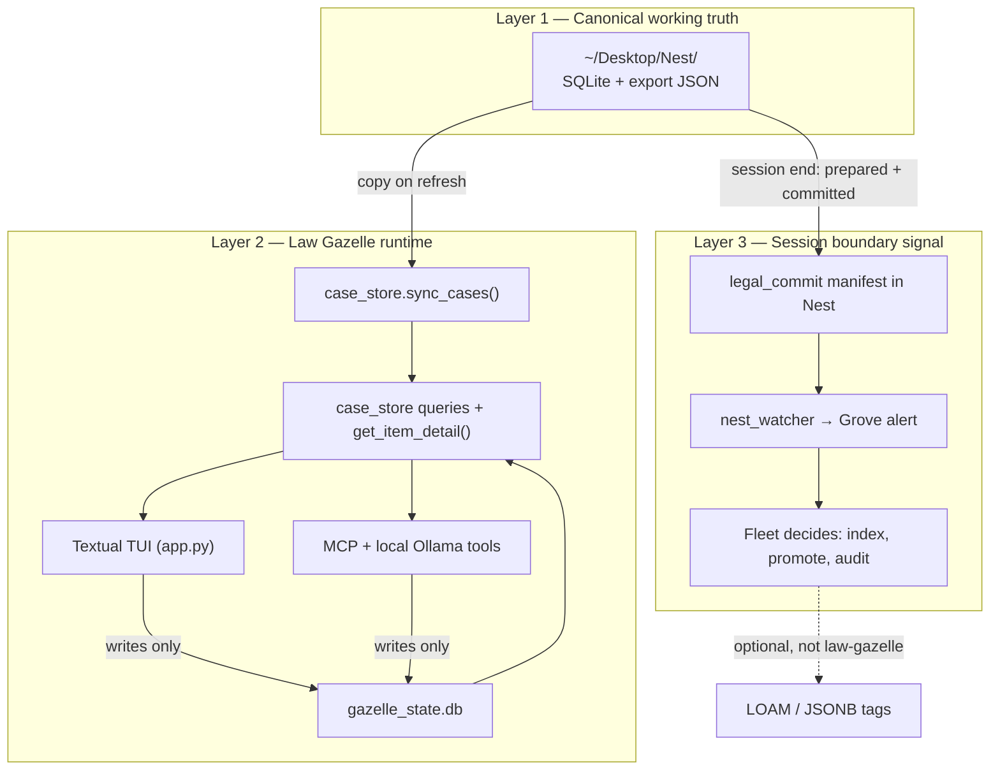

# Law Gazelle — Architecture & Roadmap Spec

**Date:** 2099-06-02  
**Status:** TUI, MCP, session commits, local-AI cache, stale-data checks, and first data-surfacing pass shipped  
**b17:** E472A  
**Branch:** `feat/ratatosk`  
**Worktree:** `~/github/safe-app-store/apps/law-gazelle`

---

## What It Is

A **case command center** for private, operator-provided legal matter data — not the generic template-engine / Postgres stub in the old repo. Public repo examples are synthetic.

Law Gazelle:

1. **Syncs** canonical case databases from Nest into app data
2. **Queries** atoms, flags, evidence, deadlines, legal documents, and cross-case intersections
3. **Surfaces** a Today workflow, matter drill-downs, milestone context, and stale-data warnings
4. **Tracks** human/agent operational state in a sidecar (resolve, snooze, notes)
5. **Displays** everything in a Textual TUI and exposes MCP tools for legal sessions

It is the **runtime operator** on prepared legal data. It does **not** author case facts during normal operation and does **not** write LOAM atoms directly.

---

## What It Is Not

| Ignored / deprecated | Why |
|---|---|
| `legal_db.py`, Postgres backend | Wrong backend for local Nest case data |
| `src/gazelle_engine.py` intake/chat flow | Template demand-letter assistant |
| Direct `willow_knowledge_ingest` at session end | Compost/promote is downstream of the watcher |
| Mutating Nest SQLite from the TUI | Nest stays canonical; only sidecar writes |

---

## Layer Model

The design converged on a three-layer mental model:



### Layer 1 — Nest (canonical)

**Location:** `~/Desktop/Nest/` (override: `NEST_SOURCE`)

| File | Role |
|---|---|
| `coparent.db` | Demo family-law matter D-000-DM-0000-00000 — atoms, issues, evidence, plan citations, state law, legal documents, correspondence, communication log, schedule, context events |
| `bankruptcy.db` | Demo bankruptcy matter — flags, checklist, creditors, coparent_intersections |
| `workers_comp.db` | Demo workers-comp matter WCA 00-00000 |
| `session_meta.db` | Build-session provenance |
| `coparent_db_export.json` | Full snapshot + `_meta.response_deadlines` |
| `Case_Letter_YYYY-MM-DD.docx` | Optional source-letter artifact |

**Format:** Relational **SQLite** (`TEXT`, `INTEGER`, `REAL`). **Not JSONB.** JSON appears only in the export file and optional TEXT reference columns.

**Authoring:** Legal work sessions (Claude + the user) write here. Law Gazelle reads.

### Layer 2 — Law Gazelle (runtime backend + visible console)

**App data:** `~/.willow/apps/law-gazelle/`

| Path | Role |
|---|---|
| `cases/` | Synced copy of Nest DBs + export JSON + artifacts |
| `gazelle_state.db` | Sidecar: resolved, snooze, user notes, activity, fact verification, local-AI cache |
| `.venv/` | Textual + deps |

**Modules:**

| Module | Purpose |
|---|---|
| `case_store.py` | Sync, queries, urgent queue, detail drill-down, cross-case, milestones |
| `gazelle_state.py` | Sidecar writes (never touches Nest) |
| `app.py` | Textual TUI — Today workflow, matters, activity/session routes, detail modals |
| `screens/detail.py` | DetailScreen, NoteModal, SnoozeModal |
| `workflow.py` | Today cards, action deck, review-facts rows, draft actions |
| `intelligence.py` | Local-Ollama ranking, brief/draft/fact inspection with content fingerprints |
| `document_store.py` | Draft context, templates, save/list drafts |
| `gazelle_mcp.py` | MCP server wrapping sync, briefing, detail, sidecar, draft, commit, AI tools |
| `commit_package.py` | Session-end legal commit manifest writer |
| `dev.sh` | venv, sync, launch |

**Principle:** One backend, multiple consumers. TUI and MCP tools call the same functions.

### Layer 3 — Session-end signal

**During session:** work happens in Nest SQLite.

**At session end:** package is **prepared and committed** — DBs saved, export JSON written, `session_meta.db` updated, artifacts present in Nest, and `legal_commit_<date>.json` written.

**Not:** law-gazelle calls LOAM ingest.

**Instead:** a **watcher** alerts the fleet that a package landed:

- Existing: `willow-1.9/tools/nest_watcher.py` polls Nest, stages via `nest_intake.scan_nest()`, sends Grove message to `#heimdallr`
- Planned: lightweight Loki watcher (KB atom 407916B5) — architecture only, code TBD
- Commit manifest path exists in Law Gazelle; watcher alert still needs manual verification in the fleet environment

**Downstream (fleet):** Heimdallr / others decide whether to promote to LOAM (Postgres `knowledge` + `tags JSONB`), index for session RAG, or no-op.

---

## Storage Format Summary

| Store | Engine | JSONB? |
|---|---|---|
| Nest case DBs | SQLite relational | No |
| `coparent_db_export.json` | JSON file | N/A (plain JSON) |
| `gazelle_state.db` | SQLite relational | No |
| `ai_cache` table | SQLite relational inside `gazelle_state.db` | No |
| LOAM `knowledge` | Postgres | `tags JSONB` — downstream only |
| SOIL `records.data` | SQLite TEXT | JSON blob — optional projection |

Law Gazelle operates on **SQLite + one JSON export**. JSONB is the **fleet compost layer**, not the case working store.

---

## Case Store API (current)

### Sync

```python
sync_cases(source: Path = ~/Desktop/Nest) -> dict
check_stale(source: Path = ~/Desktop/Nest) -> list[str]
# Copies CASE_DBS + SYNC_EXTRAS + SESSION_META + artifacts into ~/.willow/.../cases/
# check_stale reports Nest DBs newer than the local app copy before the user sees stale output.
```

### Queues & summaries

```python
urgent_queue(show_resolved: bool = False) -> list[dict]
milestone_banner() -> str
list_cases() -> list[dict]
cross_case_overview() -> dict
session_overview() -> dict
bankruptcy_overview() -> dict
workers_comp_overview() -> dict | None
coparent_atoms(status="open") -> list[dict]
legal_documents(limit=25) -> list[dict]
schedule_response_packet(include_resolved=False) -> dict
briefing_packet(include_session=False) -> dict
```

### Detail (returns dict; TUI renders via format_detail_text)

```python
get_item_detail(source_db, item_type, item_id) -> dict | None
format_detail_text(detail) -> str
```

**Supported item types:**

| item_type | source_db | item_id |
|---|---|---|
| `atom` | coparent, workers_comp | atom_id |
| `flag` | bankruptcy | flag_id |
| `deadline` | coparent | `deadline:schedule` / `deadline:all_other` |
| `legal_document` | coparent | doc_id |
| `intersection` | bankruptcy | issue string |
| `creditor` | bankruptcy | creditor_id |
| `context_event` | coparent | numeric id |
| `case` | coparent, bankruptcy, workers_comp | case key |
| `session_meta` | session | meta key |
| `session_decision` | session | decision id |
| `artifact` | session | filename |
| `checklist_item` | bankruptcy | doc_type |

### Sidecar (writes)

```python
gazelle_state.mark_resolved(source_db, item_type, item_id)
gazelle_state.snooze_until(source_db, item_type, item_id, until_date)
gazelle_state.add_note(source_db, item_type, item_id, body)
```

Sidecar merges into `urgent_queue()` and surfaced matter rows via `_merge_overlay()` — resolved/snoozed items hidden from urgent queue unless `show_resolved=True`.

---

## TUI (shipped)

**Run:**

```bash
cd apps/law-gazelle && ./dev.sh
```

**Routes:** Today, action deck, fact review, matters, matter drill-downs, drafts, session, activity.

**Matter coverage:** Coparent atoms + legal documents; bankruptcy flags/cases/checklist; workers-comp atoms when DB is present; cross-case intersections/creditors/context; all-cases summary.

**Keys:**

| Key | Action |
|---|---|
| Enter / v | Detail modal |
| r | Refresh (re-sync from Nest) |
| m | Matters |
| d | Drafts route |
| a | Activity route |
| s | Session route |
| x | Mark done → sidecar |
| n | Add note → sidecar |
| z | Snooze → sidecar |
| t | Toggle show resolved on Today |
| f / Shift+F | AI inspect cached / force re-inspect on Review Facts |
| o | Open artifact (Session tab, selected row) |
| q | Quit |

**Milestone banner:** Reads `_meta.response_deadlines` from `coparent_db_export.json` when available and may include operator-configured static context.

---

## Hard Deadlines & Case Context (embedded in data)

| Domain | Identifier | Notes |
|---|---|---|
| Coparent | D-000-DM-0000-00000 | Example County, ST |
| Bankruptcy | BK-0000-DEMO | Synthetic demo matter |
| Workers comp | WCA 00-00000 | Synthetic demo scaffold |
| Letter | Case_Letter_YYYY-MM-DD.docx | Optional source-letter artifact; response deadlines in export `_meta` |

---

## MCP + Local-AI Layer (shipped)

**Role:** Reasoning, drafting, "what should I do Tuesday?" — reads Layer 2, writes only sidecar or explicit draft/commit files in Nest.

**Consumption pattern:**

```python
# Briefing
briefing_packet(include_session=True)

# Drill-down
get_item_detail("coparent", "atom", "ATM-001")  # prefer dict over format_detail_text

# Actions
gazelle_state.add_note(...)
gazelle_state.mark_resolved(...)
```

**MCP tools:** `gazelle_sync`, `gazelle_briefing`, `gazelle_urgent`, `gazelle_detail`, `gazelle_note`, `gazelle_resolve`, `gazelle_schedule`, `gazelle_draft`, `gazelle_chronology`, `gazelle_save`, `gazelle_commit`, `gazelle_llm_health`, `gazelle_ai_brief`, `gazelle_ai_draft`, `gazelle_ai_rank_today`, `gazelle_ai_inspect_fact`.

**AI cache:** local sidecar cache keyed by content fingerprint. Cache invalidates when source content/verification/evidence changes, expires after 7 days, and supports `force=True` bypass from MCP and Shift+F in the TUI. The TUI preflights cache status before worker launch.

**Do not:** give the agent direct Nest SQLite write access or LOAM ingest from law-gazelle.

---

## Session-End Commit Signal

### Problem

`nest_watcher` detects **new files** in Nest. Legal sessions **update `.db` files in place** and rewrite export JSON. The watcher may not re-alert without an explicit marker.

### Commit manifest

At end of a legal build session, write a small JSON file to Nest:

**Filename:** `legal_commit_<ISO-date>.json`

```json
{
  "kind": "law_gazelle_commit",
  "status": "prepared",
  "committed_at": "2099-06-02T06:00:00Z",
  "session_date": "2099-06-02",
  "case_number": "D-000-DM-0000-00000",
  "files": [
    "coparent.db",
    "bankruptcy.db",
    "workers_comp.db",
    "session_meta.db",
    "coparent_db_export.json",
    "Case_Letter_YYYY-MM-DD.docx"
  ],
  "summary": "Session summary; case DBs/export/drafts ready for watcher"
}
```

### Watcher behavior

1. `nest_intake._classify()` — recognize `legal_commit_<date>.json` as track `legal` / `law_gazelle_commit`
2. `nest_watcher` — Grove message, e.g.:
   ```
   [nest] law-gazelle package committed — session 2099-06-02, 6 files, case D-000-DM-0000-00000
   ```
3. Fleet (Heimdallr / Loki watcher) — optional LOAM promote, session index, audit log
4. Law Gazelle — `sync_cases()` on next refresh; Session tab reads latest manifest when present

### Who writes the manifest

| Option | Writer |
|---|---|
| A | `gazelle_commit` MCP tool |
| B | `scripts/commit_package.py` in law-gazelle |
| C | Nest pipeline stage after scrub |

Recommended paths are **A** from MCP sessions or **B** manually from the CLI — both keep the ritual explicit.

### Alternative: extend watcher for DB mtime

Poll `coparent.db` + `session_meta.db` mtimes; alert on change. Simpler for author, noisier (every save triggers alert). Manifest is preferred.

---

## Phase Roadmap

### Phase 0 — Done ✓

- [x] Nest sync into `~/.willow/apps/law-gazelle/cases/`
- [x] `case_store` queries + detail drill-down
- [x] `gazelle_state` sidecar
- [x] Textual TUI with all tabs wired to detail
- [x] Urgent queue v2 (days-until, overdue-first, sidecar filter)
- [x] Cross-case tab + milestones
- [x] Workers comp scaffold script
- [x] Active test suite (`python3 -m pytest tests`, 69 tests)
- [x] `dev.sh` worktree launcher

### Phase 1 — Session boundary (mostly done)

- [x] `commit_package.py` + `scripts/commit_package.py` — write manifest to Nest from current case files + drafts
- [x] `gazelle_commit` MCP tool
- [x] Classify manifest in `nest_intake._classify()` (willow-1.9)
- [ ] Verify `nest_watcher` alerts on manifest drop (manual)
- [x] Session tab: show last commit manifest if present
- [x] Document ritual: build session → commit manifest → watcher alert → `./dev.sh`

### Phase 2 — Workflow + LLM consumer (done)

- [x] `briefing_packet()` in `case_store.py`
- [x] MCP tool surface for sync, urgent, detail, notes, resolve, schedule, draft/save, chronology, commit, AI
- [x] Today workflow, action deck, review-facts gate
- [x] Agent write path: sidecar only for resolve/note; explicit Nest writes only for drafts and commit manifests
- [x] Structured JSON and markdown-oriented contexts where useful

### Phase 3 — Correctness + first data surfacing (in progress)

- [x] AI cache content fingerprint, 7-day TTL, force bypass, TUI cache preflight
- [x] Stale DB detection before render and after sync
- [x] Dynamic milestones from `coparent_db_export.json` plus optional static context
- [x] Indexes on sidecar notes/activity and workers-comp table whitelist
- [x] Bankruptcy checklist rows → detail type
- [x] First missing-data path surfaced: `legal_documents` in Coparent matter drill-down and `gazelle_detail`
- [x] Update `safe-app-manifest.json`, `pyproject.toml`, and spec to reflect case command center
- [ ] Update README when the local markdown read hook permits it
- [ ] PDF sync when source files appear in Nest (`legal_documents.content_notes` → file path)
- [ ] Surface remaining populated coparent/bankruptcy tables (`decision_log`, communication/correspondence, schedule, hearing log)
- [ ] Archive or remove dead stubs (`legal_db.py`, old `SAFESession` path) from active docs

---

## Run & Test

```bash
# Launch
cd apps/law-gazelle && ./dev.sh

# Sync only
python3 app.py --sync-only

# Tests (active suite)
python3 -m pytest tests

# Note: bare `python3 -m pytest` also collects `_archived/test_case_store.py`,
# which currently collides with `tests/test_case_store.py`.

# Scaffold workers comp in Nest (once)
python3 scripts/scaffold_workers_comp.py
```

---

## Open Questions / Gates

1. **Watcher verification** — confirm `legal_commit_<date>.json` produces the intended fleet alert.
2. **Remaining data surfacing** — choose next populated table group after `legal_documents`.
3. **CourtListener integration** — `include_courtlistener` is accepted by AI tools but raw REST/MCP integration remains Horizon 2.
4. **Draft evidence guard** — decide whether saved drafts must reject unverified facts automatically.
5. **Privacy gate** — no public push until PII scrub confirms repo history and docs contain only app/test/demo data.

---

## Related Specs & Code

| Resource | Path |
|---|---|
| Nest pipeline spec | `safe-app-store/docs/specs/willow_nest_spec.md` |
| System spec (LOAM/SOIL/Grove) | `safe-app-store/docs/system_spec.md` |
| Nest watcher | `github/willow-1.9/tools/nest_watcher.py` |
| Nest intake | `github/willow-1.9/sap/core/nest_intake.py` |
| Ratatosk tool loop | `safe-app-store/apps/ratatosk/ratatosk/tools.py` |

---

ΔΣ=42
