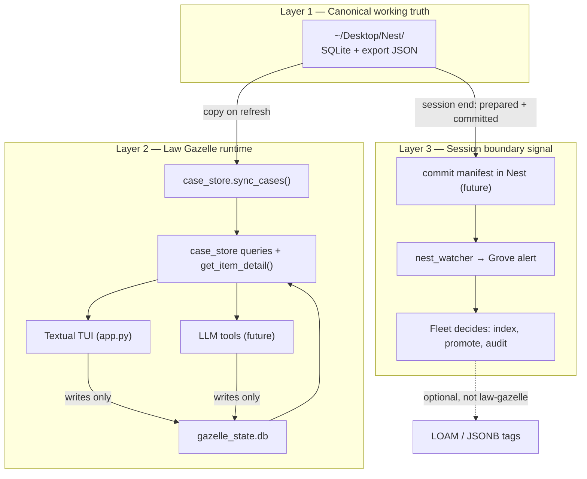

# Law Gazelle — Architecture & Roadmap Spec

**Date:** 2026-05-24  
**Status:** Backend + TUI shipped; LLM layer and watcher commit signal not wired  
**b17:** E472A  
**Branch:** `feat/law-gazelle`  
**Worktree:** `/home/sean-campbell/safe-app-store/.worktrees/law-gazelle`

---

## What It Is

A **case command center** for Sean's real legal situations — not the generic template-engine / Postgres stub in the old repo.

Law Gazelle:

1. **Syncs** canonical case databases from Nest into app data
2. **Queries** atoms, flags, evidence, deadlines, cross-case intersections
3. **Surfaces** an urgent queue with milestone context
4. **Tracks** human/agent operational state in a sidecar (resolve, snooze, notes)
5. **Displays** everything in a Textual TUI (visible backend)

It is the **runtime operator** on prepared legal data. It does **not** author case facts during normal operation and does **not** write LOAM atoms directly.

---

## What It Is Not

| Ignored / deprecated | Why |
|---|---|
| `legal_db.py`, Postgres `sweet_pea_rudi19.*` | Wrong backend; not Sean's data |
| `src/gazelle_engine.py` intake/chat flow | Template demand-letter assistant |
| Direct `willow_knowledge_ingest` at session end | Compost/promote is downstream of the watcher |
| Mutating Nest SQLite from the TUI | Nest stays canonical; only sidecar writes |

---

## Layer Model

Sean converged on a three-layer mental model:


```mermaid
flowchart TB
    subgraph L1 [Layer 1 — Canonical working truth]
        Nest["~/Desktop/Nest/\nSQLite + export JSON"]
    end

    subgraph L2 [Layer 2 — Law Gazelle runtime]
        Sync["case_store.sync_cases()"]
        Query["case_store queries + get_item_detail()"]
        Sidecar["gazelle_state.db"]
        TUI["Textual TUI (app.py)"]
        LLM["LLM tools (future)"]
    end

    subgraph L3 [Layer 3 — Session boundary signal]
        Manifest["commit manifest in Nest (future)"]
        Watcher["nest_watcher → Grove alert"]
        Fleet["Fleet decides: index, promote, audit"]
    end

    Nest -->|"copy on refresh"| Sync
    Sync --> Query
    Sidecar --> Query
    Query --> TUI
    Query --> LLM
    TUI -->|"writes only"| Sidecar
    LLM -->|"writes only"| Sidecar
    Nest -->|"session end: prepared + committed"| Manifest
    Manifest --> Watcher
    Watcher --> Fleet
    Fleet -.->|"optional, not law-gazelle"| LOAM["LOAM / JSONB tags"]
```

### Layer 1 — Nest (canonical)

**Location:** `~/Desktop/Nest/` (override: `NEST_SOURCE`)

| File | Role |
|---|---|
| `coparent.db` | Family law D-000-DM-0000-00000 — atoms, issues, evidence, plan citations, state law, correspondence, context events |
| `bankruptcy.db` | Ch. 13 dismissed → Ch. 7 — flags, checklist, creditors, coparent_intersections |
| `workers_comp.db` | WCA 00-00000 (scaffolded; narrative also in coparent) |
| `session_meta.db` | Build-session provenance (May 23/24 night) |
| `coparent_db_export.json` | Full snapshot + `_meta.response_deadlines` |
| `Campbell_Letter_May23_2026.docx` | Sent letter artifact |

**Format:** Relational **SQLite** (`TEXT`, `INTEGER`, `REAL`). **Not JSONB.** JSON appears only in the export file and optional TEXT reference columns.

**Authoring:** Legal work sessions (Claude + Sean) write here. Law Gazelle reads.

### Layer 2 — Law Gazelle (runtime backend + visible console)

**App data:** `~/.willow/apps/law-gazelle/`

| Path | Role |
|---|---|
| `cases/` | Synced copy of Nest DBs + export JSON + artifacts |
| `gazelle_state.db` | Sidecar: resolved, snooze, user notes |
| `.venv/` | Textual + deps |

**Modules:**

| Module | Purpose |
|---|---|
| `case_store.py` | Sync, queries, urgent queue, detail drill-down, cross-case, milestones |
| `gazelle_state.py` | Sidecar writes (never touches Nest) |
| `app.py` | Textual TUI — tabs, keybindings, detail modals |
| `screens/detail.py` | DetailScreen, NoteModal, SnoozeModal |
| `dev.sh` | venv, sync, launch |

**Principle:** One backend, multiple consumers. TUI and future LLM tools call the same functions.

### Layer 3 — Session-end signal (design intent, not fully wired)

**During session:** work happens in Nest SQLite.

**At session end:** package is **prepared and committed** — DBs saved, export JSON written, `session_meta.db` updated, artifacts present in Nest.

**Not:** law-gazelle calls LOAM ingest.

**Instead:** a **watcher** alerts the fleet that a package landed:

- Existing: `willow-1.9/tools/nest_watcher.py` polls Nest, stages via `nest_intake.scan_nest()`, sends Grove message to `#heimdallr`
- Planned: lightweight Loki watcher (KB atom 407916B5) — architecture only, code TBD
- Gap: watcher today detects **new files**, not in-place `.db` updates; needs a **commit manifest** or mtime policy

**Downstream (fleet):** Heimdallr / others decide whether to promote to LOAM (Postgres `knowledge` + `tags JSONB`), index for session RAG, or no-op.

---

## Storage Format Summary

| Store | Engine | JSONB? |
|---|---|---|
| Nest case DBs | SQLite relational | No |
| `coparent_db_export.json` | JSON file | N/A (plain JSON) |
| `gazelle_state.db` | SQLite relational | No |
| LOAM `knowledge` | Postgres | `tags JSONB` — downstream only |
| SOIL `records.data` | SQLite TEXT | JSON blob — optional projection |

Law Gazelle operates on **SQLite + one JSON export**. JSONB is the **fleet compost layer**, not the case working store.

---

## Case Store API (current)

### Sync

```python
sync_cases(source: Path = ~/Desktop/Nest) -> dict
# Copies CASE_DBS + SYNC_EXTRAS + SESSION_META + artifacts into ~/.willow/.../cases/
```

### Queues & summaries

```python
urgent_queue(show_resolved: bool = False) -> list[dict]
milestone_banner() -> str
list_cases() -> list[dict]
cross_case_overview() -> dict
session_overview() -> dict
bankruptcy_overview() -> dict
workers_comp_overview() -> dict | None
coparent_atoms(status="open") -> list[dict]
```

### Detail (returns dict; TUI renders via format_detail_text)

```python
get_item_detail(source_db, item_type, item_id) -> dict | None
format_detail_text(detail) -> str
```

**Supported item types:**

| item_type | source_db | item_id |
|---|---|---|
| `atom` | coparent, workers_comp | atom_id |
| `flag` | bankruptcy | flag_id |
| `deadline` | coparent | `deadline:schedule` / `deadline:all_other` |
| `intersection` | bankruptcy | issue string |
| `creditor` | bankruptcy | creditor_id |
| `context_event` | coparent | numeric id |
| `case` | coparent, bankruptcy, workers_comp | case key |
| `session_meta` | session | meta key |
| `session_decision` | session | decision id |
| `artifact` | session | filename |

### Sidecar (writes)

```python
gazelle_state.mark_resolved(source_db, item_type, item_id)
gazelle_state.snooze_until(source_db, item_type, item_id, until_date)
gazelle_state.add_note(source_db, item_type, item_id, body)
```

Sidecar merges into `urgent_queue()` via `_merge_overlay()` — resolved/snoozed items hidden unless `show_resolved=True`.

---

## TUI (shipped)

**Run:**

```bash
cd apps/law-gazelle && ./dev.sh
# or worktree: .worktrees/law-gazelle/apps/law-gazelle
```

**Tabs:** Urgent, Cases, Coparent, Bankruptcy, Workers Comp, Cross-Case, Session

**Keys:**

| Key | Action |
|---|---|
| Enter / v | Detail modal |
| r | Refresh (re-sync from Nest) |
| d | Mark done → sidecar |
| n | Add note → sidecar |
| s | Snooze → sidecar |
| u | Toggle show resolved |
| o | Open artifact (Session tab, selected row) |
| q | Quit |

**Milestone banner:** May 30 (schedule), June 6 (all other letter items), July 1 (city job / Ch7 / support).

---

## Hard Deadlines & Case Context (embedded in data)

| Domain | Identifier | Notes |
|---|---|---|
| Coparent | D-000-DM-0000-00000 | Example County NM |
| Bankruptcy | Ch. 13 dismissed 2026-05-12 → Ch. 7 organizing | |
| Workers comp | WCA 00-00000 | Scaffolded DB; narrative in coparent atoms |
| Letter | Campbell_Letter_May23_2026.docx | Sent; response deadlines in export `_meta` |

---

## LLM Layer (future — not wired)

**Role:** Reasoning, drafting, "what should I do Tuesday?" — reads Layer 2, writes only sidecar.

**Consumption pattern:**

```python
# Briefing
urgent_queue() + milestone_banner() + cross_case_overview()

# Drill-down
get_item_detail("coparent", "atom", "ATM-001")  # prefer dict over format_detail_text

# Actions
gazelle_state.add_note(...)
gazelle_state.mark_resolved(...)
```

**Integration options (pick one or both):**

1. **Python import** — Ratatosk / local agent calls `case_store` directly (simplest)
2. **MCP tools** — `gazelle_sync`, `gazelle_urgent`, `gazelle_detail`, `gazelle_note` wrapping same functions
3. **Briefing helper** — `briefing_packet() -> dict` bundling urgent + milestones + session meta (small addition)

**Do not:** give the agent direct Nest SQLite write access or LOAM ingest from law-gazelle.

---

## Session-End Commit Signal (future — spec)

### Problem

`nest_watcher` detects **new files** in Nest. Legal sessions **update `.db` files in place** and rewrite export JSON. The watcher may not re-alert without an explicit marker.

### Proposed: commit manifest

At end of a legal build session, write a small JSON file to Nest:

**Filename:** `law_gazelle_commit.json` (or `legal_commit_<ISO-date>.json`)

```json
{
  "kind": "law_gazelle_commit",
  "status": "prepared",
  "committed_at": "2026-05-24T17:15:00Z",
  "session_date": "2026-05-23/24",
  "case_number": "D-000-DM-0000-00000",
  "files": [
    "coparent.db",
    "bankruptcy.db",
    "workers_comp.db",
    "session_meta.db",
    "coparent_db_export.json",
    "Campbell_Letter_May23_2026.docx"
  ],
  "summary": "Letter sent; 21 atoms; deadlines May 30 / June 6"
}
```

### Watcher behavior (to implement)

1. `nest_intake._classify()` — recognize `law_gazelle_commit.json` as track `legal` (or new track `law_gazelle_commit`)
2. `nest_watcher` — Grove message, e.g.:
   ```
   [nest] law-gazelle package committed — session 2026-05-23/24, 6 files, case D-000-DM-0000-00000
   ```
3. Fleet (Heimdallr / Loki watcher) — optional LOAM promote, session index, audit log
4. Law Gazelle — `sync_cases()` on next refresh; no change required beyond optionally **reading** manifest for Session tab

### Who writes the manifest

| Option | Writer |
|---|---|
| A | Legal build session (Claude) at session close |
| B | Small `scripts/commit_package.py` in law-gazelle |
| C | Nest pipeline stage after scrub |

Recommend **B** callable from build session or manually — keeps ritual explicit.

### Alternative: extend watcher for DB mtime

Poll `coparent.db` + `session_meta.db` mtimes; alert on change. Simpler for author, noisier (every save triggers alert). Manifest is preferred.

---

## Phase Roadmap

### Phase 0 — Done ✓

- [x] Nest sync into `~/.willow/apps/law-gazelle/cases/`
- [x] `case_store` queries + detail drill-down
- [x] `gazelle_state` sidecar
- [x] Textual TUI with all tabs wired to detail
- [x] Urgent queue v2 (days-until, overdue-first, sidecar filter)
- [x] Cross-case tab + milestones
- [x] Workers comp scaffold script
- [x] `tests/test_case_store.py` (7 tests)
- [x] `dev.sh` worktree launcher

### Phase 1 — Session boundary (next)

- [ ] `scripts/commit_package.py` — write manifest to Nest from current case files
- [ ] Classify manifest in `nest_intake._classify()`
- [ ] Verify `nest_watcher` alerts on manifest drop
- [ ] Session tab: show last commit manifest if present
- [ ] Document ritual: build session → commit manifest → watcher alert → `./dev.sh`

### Phase 2 — LLM consumer

- [ ] `briefing_packet()` in `case_store.py`
- [ ] MCP tool surface OR Ratatosk tool registration
- [ ] Agent write path: sidecar only, with confirmation for `mark_resolved`
- [ ] Optional: `format_detail_text` vs structured JSON toggle for agent context

### Phase 3 — Polish

- [ ] PDF sync when source files appear in Nest (`legal_documents.content_notes` → file path)
- [ ] Bankruptcy checklist rows → detail type
- [ ] Stale manifest / sync conflict detection (Nest newer than local copy)
- [ ] Update `safe-app-manifest.json` and README to reflect case command center (not generic legal reference)
- [ ] Archive or remove dead stubs (`legal_db.py`, old `SAFESession` path) from active docs

---

## Run & Test

```bash
# Launch
cd apps/law-gazelle && ./dev.sh

# Sync only
python3 app.py --sync-only

# Tests
python3 -m unittest tests.test_case_store -v

# Scaffold workers comp in Nest (once)
python3 scripts/scaffold_workers_comp.py
```

---

## Open Questions (for Sean on return)

1. **Commit manifest filename** — fixed `law_gazelle_commit.json` vs dated files?
2. **Grove channel** — `#heimdallr` (current nest-watcher) vs `#fleet` vs `#vishwakarma`?
3. **LLM entry point** — Ratatosk module import, MCP server in law-gazelle, or Cursor-only?
4. **Nest write-back** — ever sync sidecar notes into Nest, or keep sidecar forever separate?
5. **LOAM domain** — if fleet promotes, use `saps1`, `law-gazelle`, or `hanuman`?

---

## Related Specs & Code

| Resource | Path |
|---|---|
| Nest pipeline spec | `safe-app-store/docs/specs/willow_nest_spec.md` |
| System spec (LOAM/SOIL/Grove) | `safe-app-store/docs/system_spec.md` |
| Nest watcher | `github/willow-1.9/tools/nest_watcher.py` |
| Nest intake | `github/willow-1.9/sap/core/nest_intake.py` |
| Ratatosk tool loop | `safe-app-store/apps/ratatosk/ratatosk/tools.py` |

---

ΔΣ=42
