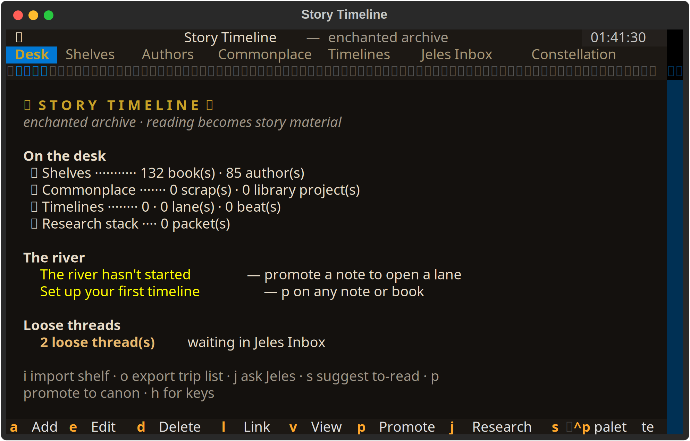
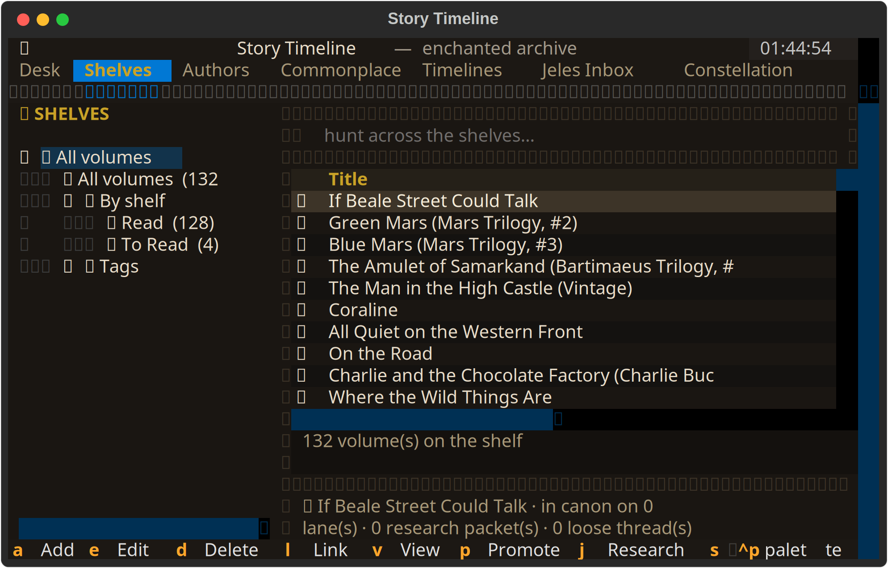

@markdownai v1.0

# Story Timeline

> A local-first writer's workbench in the terminal. Reading shelf, commonplace notebook, writing projects, named timelines — and a graph that ties it all together.

---

## What is it?

Story Timeline is a Textual TUI for writers who read seriously. It keeps your books, research notes, and writing projects in one place and lets you trace the line from source material to scene.

You keep a reading shelf. You keep a commonplace notebook — quotes, ideas, passages that matter. When you start a writing project you build named timelines (world chronology, draft beats, process log). Then you **promote** material: a note becomes a timeline entry with a provenance link back to the source. The graph is yours, local, and queryable.

Willow integration is optional. When it's running you get cited Jeles research on any node, local SLM promotion suggestions, and edges stored in a personal SOIL graph. When it's not, the app still works as a fully self-contained SQLite library.

---

## Screenshots





---

## Install

Requires Python 3.10+. Works on Linux, macOS, Windows, and WSL.

### Linux / macOS — one command

```bash
./dev.sh
```

The launcher creates a venv at `~/.willow/apps/story-timeline/.venv`, installs dependencies, and starts the TUI. Run it again any time — it skips setup if the venv already exists.

### Windows PowerShell

```powershell
.\dev.ps1
```

If PowerShell blocks local scripts:

```powershell
Set-ExecutionPolicy -Scope CurrentUser RemoteSigned
```

### Manual / any platform

```bash
python -m venv .venv
source .venv/bin/activate       # Windows: .\.venv\Scripts\Activate.ps1
pip install -r requirements.txt
python app.py
```

### pip install (editable)

```bash
pip install -e .
story-timeline
```

---

## Keys

| Key | Action |
|-----|--------|
| `a` | Add node — book, author, note, project, timeline, theme, character, place, event |
| `e` | Edit selected |
| `d` | Delete selected |
| `l` | Link — searchable node picker + relation label |
| `v` | View node detail (Markdown render, provenance chain) |
| `p` | Promote selected note/book into a timeline entry |
| `j` | Research selected node with Jeles (cited sources saved locally) |
| `s` | Suggest promotion — SLM proposal, Jeles context, KB — you review and accept |
| `i` | Import CSV (Goodreads / StoryGraph / LibraryThing) |
| `o` | Export trip list + Goodreads CSV |
| `/` | Search (Books tab) |
| `r` | Refresh |
| `h` / `?` | Help |
| `q` | Quit (writes session composite to Willow if connected) |

---

## Import your reading history

```bash
# From inside the TUI — press i
# Or from the command line:
python import_csv.py ~/Downloads/goodreads_library_export.csv --authors
```

Supported: Goodreads, StoryGraph, LibraryThing. Creates author nodes and `written_by` edges automatically.

---

## Story protocol CLI

Promote commonplace material into named timelines from the command line:

```bash
# Create a project and a timeline
python promote.py create-project --title "My Novel"
python promote.py create-timeline --project <project_id> --name "World chronology"

# Promote a note or book into a timeline entry
python promote.py promote <node_id> --timeline <timeline_id>
python promote.py promote <node_id> --project <project_id> --timeline-name "World chronology"

# Inspect
python promote.py list-projects
python promote.py list-timelines --project <project_id>
python promote.py list-entries --timeline <timeline_id>
```

---

## Browser mirror

The same app runs in a browser tab — useful on small screens or for sharing a view:

```bash
textual serve app.py
# or
./dev.sh --serve
```

---

## Willow integration (optional)

When [Willow](https://github.com/yourusername/willow-2.0) is running locally:

- **`j`** — Jeles research pulls cited sources for any node and saves a research packet
- **`s`** — SLM suggestion gathers KB context, Jeles results, and local inference to propose a timeline promotion
- Edges persist in a personal SOIL graph under `~/.willow/store/`
- Session composite written on quit

Without Willow, the TUI works fully — SQLite only, no graph edges, no Jeles.

Set `STORY_TIMELINE_DISABLE_MCP=1` to explicitly skip MCP startup.

---

## Data

| Path | Contents |
|------|----------|
| `~/.willow/store/story-timeline/timeline.db` | Local SQLite — books, notes, authors, projects, protocol records |
| `~/.willow/store/user-{uuid}/story-timeline/` | Willow SOIL atoms — timelines, entries, provenance, session composites |
| `~/.willow/story-timeline-mcp.log` | MCP stderr log |

Override the DB path for tests:

```bash
STORY_TIMELINE_DB=/tmp/test.db python app.py
```

---

## Protocol record types

| Type | Role |
|------|------|
| `commonplace_item` | Captured idea, quote, or research note |
| `writing_project` | Container for a story, essay, world, or draft |
| `timeline` | Named timeline under a project |
| `timeline_entry` | Scene, beat, milestone, or fact |
| `provenance` | Link from a timeline entry back to its source material |
| `session_composite` | Activity summary written at quit |
| `slm_suggestion` | Pending or accepted SLM promotion proposals |
| `research_packet` | Jeles-cited research attached to a library node |

Standard relations: `derived_from`, `belongs_to_project`, `appears_on_timeline`, `inspired_by`, `supports_scene`, `contradicts_or_tensions_with`

---

## Why local-first?

Your reading history and writing notes are yours. Nothing leaves your machine unless you explicitly push it to Willow — and Willow is also local. The app works with no network, no accounts, no subscriptions.

---

## Part of the SAFE App Store

Story Timeline is one app in a local-first personal AI toolkit. The shared Willow layer lets apps find each other's atoms — Ask Jeles can surface research you saved here; the Binder can pick up provenance links. Each app owns its namespace; cross-app reads require explicit consent.

---

## Requirements

- Python 3.10+
- [Textual](https://github.com/Textualize/textual) 0.47+
- `mcp` package (for Willow integration — gracefully skipped if absent)
- Willow 2.0 (optional — Jeles research, SOIL graph, SLM suggestions)
