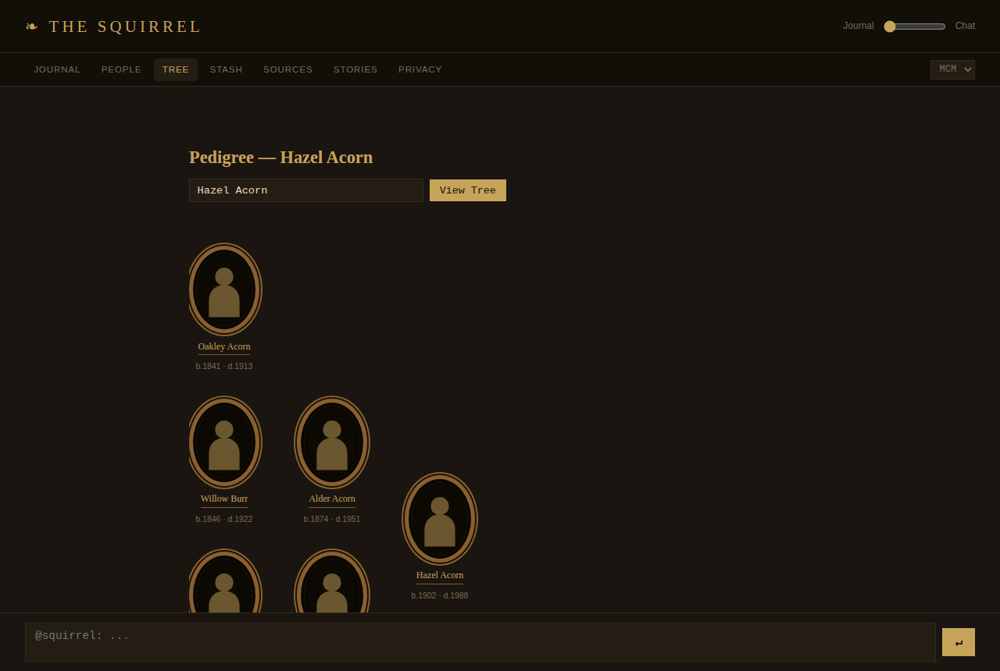
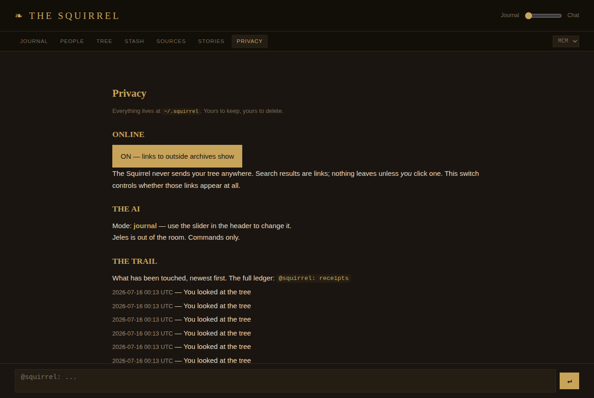

# The Squirrel
*We're not calling your family nuts... but.*

You've seen the ad. The stranger's face that looks like yours. The
grandmother's letter. The reunion at the airport, scored for strings.
It's a beautiful ad, and it's selling you a spit tube — the feeling is
real, and the vehicle is a company that keeps your genome as inventory.

The Squirrel gives you the feeling and keeps nothing.

## Your tree stays in your tree

Everything lives in one folder on your machine: `~/.squirrel`. The tree
is a SQLite file. The secrets are encrypted to a key that never leaves
the house. There is no account, no subscription, no cloud, and no
company on the other end. Yours to keep, yours to delete — deleting the
folder is a complete and total exit, and nothing breaks somewhere else.

**The Squirrel makes zero network calls.** Search for records and you
get *links* — FamilySearch, Find a Grave, community archives, 779 of
them indexed locally. Nothing leaves this machine unless you click.
That's not a policy promise; it's how the code is built, and there's a
test that fails if anyone ever adds a socket.

## The file is the interface

The app is a journal — a markdown file you type into:

    @squirrel: add person Hazel Acorn b.1902 p.Cedar_Grove
    @squirrel: link Hazel Acorn → parent → Alder Acorn
    @squirrel: tree Hazel Acorn

The scroll-up history is your research log. Two runs of the same
command, months apart, show you what changed.

## The AI is a guest, not a ghost

Jeles — the librarian — can join when invited: a slider, three
positions. *Journal* (out of the room), *Listening* (may offer a note),
*Chat* (converses). Jeles runs locally via Ollama, and holds a
**read-only key**: the permission system physically cannot grant the AI
the ability to change your tree or carry it out. Every touch — yours
and Jeles's — lands in a receipt trail you can read in plain sentences.

## Sixty seconds to a tree

    make run app=the-squirrel      # or: python3 squirrel_app.py

The browser opens. Type `@squirrel: demo load` and meet the Acorns —
nine fictional relatives, three generations, a stash of family rumors —
so every view shows you what it's for. `@squirrel: demo clear` and the
house is yours.

When it's real: `@squirrel: export gedcom` writes a standard GEDCOM
file any genealogy tool can read. Your tree was always yours; that's
just the receipt.

---

*Part of the SAFE suite: no ports, no servers, no subscriptions.*

ΔΣ=42
