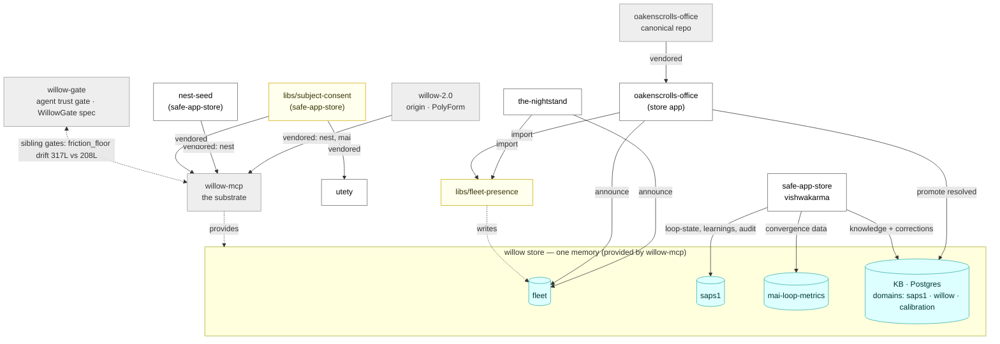

# Fleet coupling map — shared atoms & shared code

How the repos actually couple. Not HTTP: a code-graph cross-repo pass finds
**zero** service calls between them (`total_cross_edges: 0`). This fleet couples
two other ways the call graph can't see:

1. **Shared atoms** — apps read/write the *same* willow store collections (one
   memory, many tools).
2. **Shared & copied code** — shared libs, and engines vendored from a common
   origin (plus drifted duplicates of the same file).

Built 2026-07-23 from the live store, the willow manifests, and the repos on
disk. Reproduce with the queries in [§ Sources](#sources).

## Shared atoms — the data coupling

Apps couple by touching the **same** store collection. The one collection two
different apps genuinely share today is `fleet` (via `libs/fleet-presence`).

| Collection (store) | Written by | Purpose |
|---|---|---|
| **`fleet`** | `the-nightstand`, `oakenscrolls-office` | presence atoms — the only collection two apps share |
| `saps1` | safe-app-store (vishwakarma) | mai-loop-state, learnings, catalog-audit corrections |
| `mai-loop-metrics` | safe-app-store | conversion-loop convergence data |
| KB (Postgres `knowledge`) | safe-app-store | domains `saps1` / `willow` / `calibration`; self-corrections, promoted predictions, ingested Willow specs |
| `hanuman_*`, `jeles_*`, `vishwakarma_*`, `willow_*`, … | seeded personas (read-only) | per-agent namespaces; `store_scope`-isolated in the manifests |

Manifest `store_scope` is the *authority* on who may write what;
`fleet`/`saps1`/`catalog`/`mai-loop-metrics` are granted to the `safe-app-store`
writer identity.

## Shared code — the import coupling

| Shared lib | Imported by |
|---|---|
| `libs/fleet-presence` | `the-nightstand`, `oakenscrolls-office` (store apps) |
| `libs/subject-consent` | `willow-mcp` (`subject_consent/`), `utety` (`utety/subject_consent/`) |

## Vendoring lineage — the copied-code coupling

| Copy | Origin | License move |
|---|---|---|
| `willow-mcp/src/willow_mcp/nest/` | `willow-2.0/sap/core` + `safe-app-store/apps/nest-seed` | PolyForm + MIT → Apache-2.0 |
| `willow-mcp/src/willow_mcp/mai/` | `willow-2.0/sap/mai/` | PolyForm → Apache-2.0 |
| `willow-mcp/src/willow_mcp/subject_consent/` | `safe-app-store/libs/subject-consent` | shared primitive |
| `utety/utety/subject_consent/` | `safe-app-store/libs/subject-consent` | shared primitive |
| `safe-app-store/apps/oakenscrolls-office/` | `oakenscrolls-office` (canonical repo) | vendored copy |

## Drift — coupling that has rotted

The same file copied into many apps, diverging. This is coupling by *shared
origin* with no shared source of truth (tracked: safe-app-store issue #83).

| File | Copies | Distinct versions |
|---|---|---|
| `safe_integration.py` | 17 | **17** (every copy different) |
| `personas.py` | 11 | **10** |
| `lattice_fallback.py` | 4 | **4** |

**Cross-repo drift — two gate implementations.** `willow-gate` (a standalone
agent trust-gate from the WillowGate DRAFT_SPEC) and `willow-mcp` are **sibling
implementations of the same gate idea**, not vendored from one another. They
share the filename `friction_floor.py` — drifted **317 lines (willow-gate) vs
208 (willow-mcp)** — and willow-mcp's gate cluster (`gate`, `friction`,
`signing`, `tier_policy`, `session_binder`, `agent_registry`) mirrors the same
trust-ladder / HMAC-bound-trust concepts. willow-gate's own README contrasts
its `friction_floor` with willow-mcp's ("watches a different surface"). Whether
willow-gate is the canonical gate willow-mcp should vendor, or the two are
deliberately separate, is the open question (cf. the consolidation logic in
safe-app-store issue #83).

## Not coupled

- **codebase-memory-mcp** — third-party fork (DeusData); the *tool* indexing the
  fleet, not part of it.
- **willow-2.0** — the origin these vendored engines came from; not a live peer.
- **Willow** — mostly docs (constitution/canon/design); coupled only by having
  its non-`.md` specs nest-ingested into the shared KB.

## Sources

- Shared atoms: `ls $WILLOW_STORE_ROOT`; manifest `store_scope` in
  `$WILLOW_HOME/mcp_apps/*/manifest.json`.
- Imports: `grep -rl "import fleet_presence\|subject_consent" <repos>`.
- Vendoring: `willow-mcp/NOTICE`; vendored-copy banners in each README.
- Drift: `md5sum` across `apps/*/{safe_integration,personas,lattice_fallback}.py`.
- No HTTP coupling: `codebase-memory-mcp … --mode cross-repo-intelligence
  --target-projects ["*"]` → `total_cross_edges: 0`.
