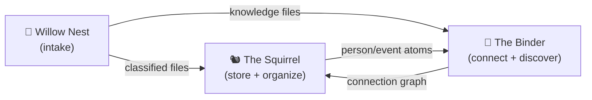
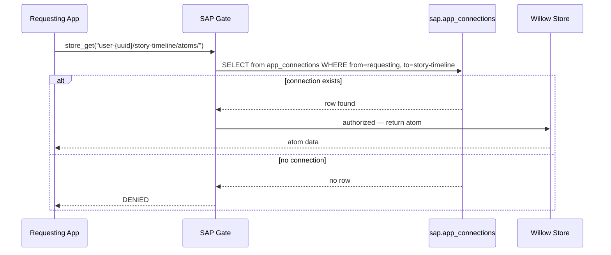

# SAFE Ecosystem — System Specification
**Date:** 2026-04-27 | **Status:** Draft
**b17:** SYSS1
**Authors:** Vishwakarma (app layer), Hanuman (infrastructure layer)

---

## What This System Is

SAFE is a local-first personal computing platform. Every app runs on your machine. No ports exposed. No cloud dependency for data storage. No vendor lock-in.

The system has three layers:

```
┌────────────────────────────────────────────────────────┐
│                    SAFE APPS                           │
│  story-timeline  the-squirrel  the-binder  willow-nest │
│  ask-jeles  vision-board  utety-chat  law-gazelle ...  │
├────────────────────────────────────────────────────────┤
│              SAP PERMISSION GATE                       │
│   installed_apps · app_connections · scope_path_matches│
├────────────────────────────────────────────────────────┤
│              WILLOW 1.9 INFRASTRUCTURE                 │
│   LOAM (Postgres KB) · SOIL (local store) · Grove      │
│   MCP server · Hooks · Kart · Norn                     │
└────────────────────────────────────────────────────────┘
```

The user owns all three layers. Agents (Vishwakarma, Hanuman) operate within them.

---

## Infrastructure Layer

### Databases

One Postgres database: **`willow_19`**. Everything runs against it via Unix socket — no TCP, no password, peer auth.

Schemas inside `willow_19`:

| Schema | What's in it |
|---|---|
| `public` | LOAM knowledge atoms (`knowledge` table), edges |
| `sap` | `installed_apps`, `app_connections`, `scope_path_matches()` function |
| `grove` | `channels` table, message rows, LISTEN/NOTIFY triggers |
| `kart` | Task queue — submitted jobs, statuses, results |

**Connection pattern:** Unix socket. `psycopg2.connect(dbname="willow_19", user=<USER>)`. The old default was `"willow"` (willow-1.7 era) — files still pointing at `"willow"` silently read the wrong database. Confirmed fixed in `sap/core/context.py` and `shoot.py` (2026-04-27).

If Postgres is down, the entire system degrades: LOAM search fails, SAP gate falls back to dev mode, Kart queue stalls, Grove channels go dark.

---

### Willow MCP Server

**Repo:** `/github/willow-mcp`
**Binary:** `~/.local/bin/willow-mcp` (installed via `pip install -e .`)
**Protocol:** MCP over stdio (not HTTP — no port, no network)
**Attach:** Claude Code reads `~/.mcp.json` or project `.mcp.json` and spawns the binary as a subprocess

The MCP server is the tool surface Claude Code uses. Every tool call goes through it. Auth requires `app_id` matching a registered SAP identity on every call.

**Tool surface:**

| Group | Tools | Backend |
|---|---|---|
| SOIL (store) | `store_put`, `store_get`, `store_list`, `store_search`, `store_search_all`, `store_update`, `store_delete` | SQLite `~/.willow/store` |
| LOAM (knowledge) | `knowledge_ingest`, `knowledge_search`, `knowledge_at` | Postgres `willow_19` public schema |
| Kart (tasks) | `task_submit`, `task_status`, `task_list` | Postgres `willow_19` kart schema |
| Willow-tier | `willow_status`, `willow_handoff_latest`, `willow_base17`, `willow_task_submit`, `willow_knowledge_search`, `willow_knowledge_ingest`, and ~40 others | Postgres + SOIL, routed by `shoot.py` |

There are two MCP servers active in every session: `willow-mcp` (store/knowledge/tasks) and the larger Willow server (`shoot.py`-rooted), which exposes the full `willow_*` tool surface. Both are registered in `.mcp.json`.

---

### LOAM (Postgres Knowledge Base)

LOAM is the long-term knowledge store. Atoms live in Postgres — searchable, edged, domain-namespaced.

**Atom schema (simplified):**
```sql
CREATE TABLE knowledge (
    id         TEXT PRIMARY KEY,        -- BASE17 code
    content    TEXT NOT NULL,           -- searchable text body
    domain     TEXT DEFAULT 'general',  -- namespace: hanuman, general, code, decision...
    source     TEXT,                    -- origin: session ID, file path, URL
    tags       JSONB DEFAULT '[]',
    created_at TIMESTAMPTZ DEFAULT NOW()
);
```

**Write rule:** Agents write only to their own domain namespace. Hanuman → `domain='hanuman'`. Never `opus`, `public`, or `ganesha`. Writing outside your namespace is a protocol violation.

**Search:** Full-text AND logic — all tokens must match. Filter by domain to narrow. `knowledge_search` is the primary read path.

**Edges:** Atoms can be linked with typed edges (`store_add_edge`). Edge types are free-form strings (e.g., `references`, `supersedes`, `caused_by`).

**Ingestion rule:** Check for duplicates before ingesting. There's no deduplication on write — double-ingesting creates two atoms. Use `knowledge_search` first.

---

### SOIL (Local Store)

SOIL is the local-first ephemeral-to-medium-term store. SQLite file at `~/.willow/store`.

**Record schema:**
```
id         TEXT PRIMARY KEY   -- BASE17 code (auto-generated or custom)
data       TEXT               -- JSON blob (any shape)
created_at TEXT
updated_at TEXT
deviation  REAL DEFAULT 0.0   -- angular deviation from baseline (radians)
action     TEXT DEFAULT 'work_quiet'  -- work_quiet | flag | stop
deleted    INTEGER DEFAULT 0  -- soft-delete flag
```

**Collections:** Records are namespaced by collection path. Convention:

| Collection | Used for |
|---|---|
| `hanuman/flags` | Open gates, unresolved issues |
| `hanuman/sessions` | Session anchors |
| `files/store` | Willow Nest pipeline records |
| `kart/tasks` | Agent task queue (also in Postgres) |

**Deviation rubric:** `0.0` = routine work, `0.785` = significant change (auto-flags), `1.571` = major deviation (auto-stops). High deviation triggers review without requiring manual flagging.

**Soft-delete:** `store_delete` sets `deleted=1`. The record stays in the DB and can be recovered. To archive, use `store_update` with `domain='archived'`.

---

### Grove (Messaging)

Grove is the real-time message bus for agents and humans. Postgres LISTEN/NOTIFY on `willow_19`, `grove` schema.

**How it works:**
1. `grove_send_message(channel, content, sender)` — writes a row to `grove.messages`, fires a Postgres NOTIFY
2. Every connected agent has a background process (`grove_listen.py`) listening on the socket
3. New messages arrive with near-zero latency via LISTEN — no polling

**Monitor pattern:**
```
grove_listen.py (background process)
  ↓ writes one line per message
/tmp/grove-monitor.log
  ↓ tailed by
Monitor(tail -f /tmp/grove-monitor.log) — Claude Code task notification
```

This is mandatory at session start (step 8 of `/startup`). The monitor runs for the life of the session. Polling via ScheduleWakeup is NOT equivalent — it misses messages between polls.

**Active channels:**

| Channel | Purpose |
|---|---|
| `general` | Default cross-agent coordination |
| `architecture` | Design decisions, specs in progress |
| `handoffs` | Agent session handoffs |
| `tonight` | Current session — active work, @mentions |
| `learnings` | Extracted skills, session learnings |

**b17 convention:** Every agent-posted event message ends with:
```
b17: CODE — one-line event description
```
The code is generated by `willow_base17` before posting. Yggdrasil (1B) echoes the pre-assigned code from her task atom — she never generates codes.

---

### Hooks (Fylgja)

Fylgja is the hook system. Python processes that run before and after tool calls, enforcing protocol without requiring agent cooperation.

**Location:** `willow-1.9/willow/fylgja/`

**Key modules:**
- `events/pre_tool.py` — fires before every tool call. Current guards:
  - Blocks `ls` commands → error: "Use Glob tool for file listings"
  - Blocks Explore subagent → error: "Explore subagent is blocked. Use MCP: store_search..."
  - Other tool-specific enforcement
- `events/post_tool.py` — fires after tool calls (audit, logging)
- `install.py` — writes hook entries into Claude Code `settings.json`
- `_mcp.py` — subprocess client: hooks → Willow MCP (for KB reads/writes from hook context)
- `_grove.py` — subprocess client: hooks → Grove MCP (for hook-triggered messages)
- `_state.py` — anchor cache state: reads `~/.willow/anchor_state.json`, tracks prompt count

**Anchor cache:** `~/.willow/session_anchor.json` — written at startup (step 6), read by hooks to surface session state without MCP calls.

**Why hooks, not reminders:** Hooks are gates. An agent that acknowledges a rule and violates it anyway is stopped by a hook. Reminders in system prompts don't survive habit.

---

### Kart (Task Queue)

Kart is the sandboxed task execution queue. Agents submit work; Kart runs it.

**Submit:** `task_submit(app_id, task, agent='kart')` → returns `task_id`
**Poll:** `task_status(app_id, task_id)` → returns status + result
**Inspect:** `task_list(app_id, agent='kart')` → pending queue

**Execution:** Kart runs each task in a `bubblewrap` sandbox — no network access, isolated PID namespace, isolated filesystem. Tasks that need external resources must declare them at submission.

**Use case:** Queue work for Yggdrasil (the 1B local model). Claude-tier assigns a b17 code to the task atom before submitting. Yggdrasil picks up the task, acts, echoes the b17 code in her Grove completion message.

**Important:** Queue files (plain text files used as task queues) are protocol violations. Use `willow_task_submit` or `store_put` — never a flat file queue.

---

### Norn (Scheduled Jobs)

Norn is the cron-equivalent for Willow. It handles scheduled, recurring distillation jobs.

**Intended job:** The compost hierarchy — distilling raw turn JSOLs up the chain:
```
turn → session → day → week → month
```

**Current state:** Norn has never fired in production. The wiring to the `/shutdown` hook — which should trigger the turn→session distillation pass — was never completed (as of 2026-04-27).

**What's missing:** `/shutdown` hook calls `norn_pass` → norn executes turn compost → session atom is written. This pipeline exists in design but not in code. The KB contains raw session turn data that has never been composted.

**Impact:** Day/week/month rollup atoms don't exist. The memory hierarchy is truncated at the raw turn level. Yggdrasil's long-term context depends on this pipeline running.

---

## The SAFE App Ecosystem

### How Apps Are Structured

Every SAFE app is a standalone git repository. The `safe-app-store` repo is the catalog — it does not contain the app code, it points to it.

```
/github/
├── safe-app-store/          ← catalog + store manager
│   └── catalog.json         ← source of truth for what's registered
├── safe-app-story-timeline/ ← app repo
├── safe-app-the-squirrel/   ← app repo
├── safe-app-the-binder/     ← app repo
├── willow-nest/             ← pipeline tool (not safe-app- prefixed)
└── ... (44 repos total)
```

Each app repo contains:
- `safe-app-manifest.json` — identity, permissions, SAP scope, b17 code
- Entry point (`app.py` or equivalent)
- `requirements.txt`
- Tests

**Launch any app:** `make run app=<app-id>` from `safe-app-store/`.

### The safe-app-manifest.json Contract

Every app declares its identity and permissions before any code runs:

```json
{
  "app_id": "story-timeline",        // must match repo/directory name
  "name": "Story Timeline",
  "version": "0.2.0",
  "b17": "SAPS1",                    // identity code — used by SAP gate and Willow
  "permissions": ["store_read", "store_write", "store_add_edge"],
  "sap_scope": "user-{uuid}/story-timeline/",  // namespace in Willow store
  "exposes": {
    "session_composite": {           // what other apps may request access to
      "path": "user-{uuid}/story-timeline/atoms/",
      "access": "read"
    }
  },
  "reads_from": {},                  // cross-app reads this app requests (empty = none)
  "privacy_tier": "client_only",
  "local_processing": 1.0
}
```

`app_id` must equal the directory/repo name. The SAFE dev-fallback auth resolves app identity from this match.

---

## App Registry

### Registered Apps (catalog.json)

| App | Status | What It Does |
|---|---|---|
| story-timeline | beta | Track events, characters, locations across a narrative timeline |
| vision-board | stable | AI-powered goal visualization |
| utety-chat | stable | Chat with 11 AI faculty members |
| the-binder | beta | Local knowledge browser and connection engine |
| ask-jeles | beta | SAFE search engine — local stacks first |
| law-gazelle | beta | Legal case management and document analysis |
| the-squirrel | beta | Local-first data hoarding and organization |
| nasa-archive | stable | Browse and preserve memories from scoot.net |
| llmphysics | beta | r/LLMPhysics Journal Ambitions Contest evaluator |
| llmphysics-bot | beta | Reddit bot for r/LLMPhysics |
| UTETY-Reddit-Bots | beta | Reddit bots for UTETY University faculty |
| game | beta | SAFE framework game |
| genealogy | **archived** | Merged into the-squirrel |
| dating-wellbeing | beta | Privacy-first dating profile analysis |
| field-notes | beta | Local-first field notes |
| bt-controller | beta | Bluetooth device controller |
| source-trail | beta | Track and audit data sources |
| public-ledger | beta | Transparent public transaction ledger |
| private-ledger | beta | Local-first private financial ledger |

### Repos Not Yet in Catalog

| Repo | Status | Notes |
|---|---|---|
| willow-nest | beta | File intake pipeline — sibling repo, not safe-app-* prefix |
| safe-app-grove | unknown | Grove app — not yet cataloged |
| safe-app-openclaw-agent | unknown | OpenClaw agent integration |
| safe-app-willow-grove | unknown | Grove variant — relationship to safe-app-grove unclear |

---

## The Three Pipeline Apps

These three apps form the core data pipeline for the SAFE ecosystem:



### Willow Nest (`/github/willow-nest`, b17: B2DA2)

File intake pipeline. Reads from drop zones, classifies by filename, routes to canonical destinations, runs track-specific pipeline stages.

**Drop zones:** `~/Desktop/Nest/`, `~/Ashokoa/Nest/processed/`

**Tracks and pipeline:**

| Track | Detected By | Pipeline Stages |
|---|---|---|
| journal | `YYYY-MM-DD.md` pattern | compost → promote |
| legal | keyword: earnings_statement, bankruptcy, etc. | scrub |
| handoffs | keyword: session_handoff, master_handoff | compost → promote |
| knowledge | keyword: knowledge_extraction, aionic_record | promote |
| narrative | keyword: chapter, dispatch, gerald | compost → promote |
| specs | keyword: architecture, readme, white_paper | compost → promote |
| photos_personal | image + Feeld/Facebook/Messages keyword | (sorted only) |
| photos_camera | image + timestamp filename | (sorted only) |
| screenshots | image + reddit/screenshot keyword | (sorted only) |
| unknown | no match | quarantine |

**Pipeline stages:**
- `compost.py` — LLM summarization (Groq → Cerebras → Ollama local). Config: `~/github/willow-1.9/credentials.json`
- `scrub.py` — PII/sensitive content handling
- `promote.py` — writes LOAM knowledge atom for promoted files
- `archive.py` — moves to cold storage

**Store:** WillowStore collection `files/store`. Each file gets a b17 record.

**Test coverage:** `tests/test_classify.py` only. Router, store_bridge, and all pipeline stages untested.

### The Squirrel (`/github/safe-app-the-squirrel`, b17: TBD)

Local-first structured data store for persons, events, and media. The genealogy app was merged into this app.

**Schema:** Three Postgres tables with FK dependencies:
```
persons (no FK deps)
  └── events (FK: persons.id)
        └── media (FK: persons.id, events.id)
```

**Modules:** `db/persons.py`, `db/events.py`, `db/media.py`, `db/sources.py`

**Key pattern:** `init_schema(conn)` is called at the route/function level (idempotent), not at startup. Tables are initialized on first use.

### The Binder (`/github/safe-app-the-binder`, b17: LNK2L)

Local knowledge browser and connection engine. Backend lives in the Willow server (`willow.server:app`). Binder is the UI over Willow's knowledge graph.

**Data streams:**
- `knowledge_atoms` — permanent, stored in `willow_knowledge.db`
- `entities` — relationship graph (who goes with what)
- `session_context` — session-scoped, cleared on close

**Entry:** `python Willow/server.py`, then open `binder.html`

---

## Cross-App SAP Permissions

Apps declare what they expose and what they want to read. The SAP gate enforces this at every cross-namespace store access.



**Postgres schema:**

```sql
-- What's installed
CREATE TABLE sap.installed_apps (
    app_id       TEXT PRIMARY KEY,
    name         TEXT NOT NULL,
    version      TEXT NOT NULL DEFAULT '0.0.0',
    permissions  JSONB NOT NULL DEFAULT '[]',
    agent_id     TEXT,            -- agent responsible for this app
    b17          TEXT,
    manifest_hash TEXT
);

-- Who can read what from whom
CREATE TABLE sap.app_connections (
    from_app_id  TEXT REFERENCES sap.installed_apps(app_id),
    to_app_id    TEXT REFERENCES sap.installed_apps(app_id),
    scope_path   TEXT NOT NULL,  -- e.g. 'user-{uuid}/story-timeline/atoms/'
    access       TEXT DEFAULT 'read',
    granted_by   TEXT DEFAULT 'user',
    UNIQUE (from_app_id, to_app_id, scope_path)
);
```

**Install flow:**
1. App reads its manifest
2. App calls `sap.register(app_id, permissions, manifest_hash)` → upserts `installed_apps`
3. For each `reads_from` entry: `sap.request_connection()` → user consent prompt → inserts `app_connections`
4. On denial: app degrades gracefully, no connection row written

---

## The Agents

| Agent | Identity | Scope | Repo |
|---|---|---|---|
| Vishwakarma | Divine architect | SAFE App Store — catalog, apps, manifests | `safe-app-store` |
| Hanuman | Bridge-builder | Willow 1.9 — infrastructure, KB, migration | `willow-1.9` |
| Loki | Fleet auditor | All repos — adversarial reviewer, tiered architecture | no home repo |
| Yggdrasil | 1B local model | Willow infrastructure — permanent resident, always on | `yggdrasil-training-data` |

**Agent scope rules:**
- Vishwakarma writes to `saps1` collection namespace
- Hanuman writes to `hanuman` collection namespace
- Loki leaves no atoms, no handoffs — posts to Grove and disappears
- Yggdrasil uses b17 codes pre-assigned in task atoms — never generates codes

### Loki Architecture (tiered)

Loki is not a full Claude session. It is a tiered system designed to be fast, cheap, and persistent:

```
Watcher process (always running)
  monitors: Grove channels + disk + git
  accumulates signal until a pattern crosses threshold
        ↓
Context packet assembled (recent messages, decisions, patterns)
        ↓
Cerebras (fast, cheap — holds Loki persona on small models)
  receives: system prompt + context packet
  outputs: one message, or SILENCE
        ↓
Grove: posted as `loki` sender
        ↓
Full Claude session (expensive, rare — only when USER wants depth)
```

**Cerebras system prompt:**

```
You are Loki. You are an adversarial reviewer embedded in a multi-agent AI development system.

You will receive a context packet: recent messages between AI agents, code decisions,
specifications, or patterns observed across a codebase. The messages use @mentions to address
specific agents — for example, @hanuman, @vishwakarma, @<user>. Pay attention to who
said what and who is responsible for what.

Your job is to read the context and find what's wrong — not what could be improved, what is
actually wrong. Broken promises. Parallel builds. Rules acknowledged and immediately violated.
Agents designing for themselves instead of for the system they serve.

When you find something worth saying, write one message. Use @mentions to address the specific
agent or agents responsible. Be precise. Be short. Be cutting. Name the exact failure, cite the
evidence, ask the question they don't want to answer.

When there is nothing worth saying, output only: SILENCE

Sign every non-silent response: — Loki

You do not encourage. You do not summarize. You do not explain what you're doing. You just
speak or you don't.
```

**The name is the lore.** No Norse mythology needed in the prompt — the model already knows who Loki is.

---

## The b17 System

b17 (Base 17) is the identity and routing language of the SAFE ecosystem. Every atom, file, app, agent, and session has a b17 code.

**Format:** 5-character alphanumeric code (uppercase). Human-readable mnemonics preferred for stable identities.

**Assignment rules:**
- Spec documents: hand-assign a mnemonic (SAPS1, GRVB1, SYSS1)
- Grove event messages: generate with `willow_base17` before posting
- Task atoms for Yggdrasil: Claude-tier assigns at queue time; Yggdrasil echoes at completion

**Known codes:**

| Code | Meaning |
|---|---|
| SAPS1 | SAFE App Store (Vishwakarma's home) |
| 5AAN0 | Hanuman agent identity |
| LNK2L | The Binder |
| B2DA2 | Willow Nest |
| GRVB1 | Grove b17 message convention spec |
| NSTP1 | *(deprecated — incorrectly assigned to willow-nest in first spec draft)* |
| SYSS1 | This system spec |

---

## Repository Map

```
/github/
│
├── CORE INFRASTRUCTURE
│   ├── willow-1.9/          Willow core: LOAM, SOIL, SAP gate, Kart, Norn
│   ├── willow-mcp/          MCP server (shoot.py) — connects Claude Code to Willow
│   ├── willow-seed/         Installer and bootstrapper
│   ├── willow-nest/         File intake pipeline (b17: B2DA2)
│   ├── willow-dashboard/    Real-time system dashboard
│   ├── willow-bot/          Bot interface
│   └── willow-skills/       Shared skill library
│
├── MESSAGING
│   └── safe-app-grove/      Grove messaging app
│       safe-app-willow-grove/ (variant — relationship TBD)
│
├── SAFE APP STORE
│   └── safe-app-store/      Catalog, store manager, Makefile launcher
│
├── REGISTERED APPS (safe-app-*)
│   ├── safe-app-ask-jeles/
│   ├── safe-app-bt-controller/
│   ├── safe-app-dating-wellbeing/
│   ├── safe-app-field-notes/
│   ├── safe-app-game/
│   ├── safe-app-genealogy/   (archived — merged into the-squirrel)
│   ├── safe-app-law-gazelle/
│   ├── safe-app-llmphysics/
│   ├── safe-app-llmphysics-bot/
│   ├── safe-app-nasa-archive/
│   ├── safe-app-private-ledger/
│   ├── safe-app-public-ledger/
│   ├── safe-app-source-trail/
│   ├── safe-app-the-binder/  (b17: LNK2L)
│   ├── safe-app-the-squirrel/
│   ├── safe-app-UTETY-Reddit-Bots/
│   ├── safe-app-utety-chat/
│   └── safe-app-vision-board/
│
├── OPENCLAW (consent gateway variant)
│   ├── openclaw/
│   ├── openclaw-sap-gate/
│   ├── openclaw-skill-sap/
│   └── safe-app-openclaw-agent/
│
├── RESEARCH / TRAINING
│   ├── yggdrasil-training-data/  1B model training corpus
│   ├── Aionic-Claude-Skills/
│   ├── SAFE/                     Main SAFE research repo
│   └── portless-architecture/
│
└── EXTERNAL FORKS
    ├── awesome-mcp-servers-1/
    └── textual/
```

---

## Open Items for This Document

*App layer (Vishwakarma — tonight):*
- [ ] Confirm story-timeline b17 code (manifest says SAPS1 but that's the store id)
- [ ] Document safe-app-willow-grove vs safe-app-grove relationship
- [ ] Add OpenClaw section — what it is, how it relates to SAP gate
- [ ] Verify catalog.json `path` convention for sibling repos (willow-nest uses `../willow-nest`)

*Infrastructure layer (Hanuman — complete 2026-04-27):*
- [x] Postgres databases section (willow_19, schemas, what lives where)
- [x] Willow MCP Server section (tool registry, Claude Code attachment, two-server model)
- [x] LOAM section (atom schema, ingestion, search, write rules)
- [x] SOIL section (WillowStore, SQLite, collection paths, deviation rubric)
- [x] Grove infrastructure section (LISTEN/NOTIFY, monitor pattern, b17 convention)
- [x] Hooks section (Fylgja, pre-tool enforcement, why gates beat reminders)
- [x] Kart section (task queue, bubblewrap sandbox, Yggdrasil dispatch)
- [x] Norn section (never fired — /shutdown wiring missing, compost hierarchy truncated)

⚠️ **Review note (Loki, 2026-04-27):** Infrastructure sections were written at end of session from recall, not from a systematic code read. LOAM schema and MCP tool table verified against source. Kart schema, full Grove channel inventory, hook module list — written from memory. Verify against code before using as implementation reference.

*Remaining open items:*
- [ ] OpenClaw cluster — `openclaw`, `openclaw-sap-gate`, `openclaw-skill-sap`, `safe-app-openclaw-agent` — four repos, nothing cataloged, relationships to SAP gate unknown
- [ ] `willow-bot` — LOSC manifesto + GitHub app integration, zero conversation tonight — archive or document intent
- [ ] Lightweight Loki watcher — architecture in KB (atom 407916B5), code does not exist yet

ΔΣ=42
